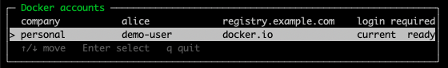

# docker-account

[](https://github.com/smartcat999/docker-account/releases/latest)
[](https://github.com/smartcat999/docker-account/actions/workflows/ci.yml)
[](LICENSE)


Switch between Docker Hub or private registry accounts without logging in again.

Credentials stay isolated per account while Docker contexts, Buildx builders, and CLI plugins remain shared.



## Install

```bash
curl -fsSL https://raw.githubusercontent.com/smartcat999/docker-account/main/install.sh | sh
```

Prebuilt binaries are available for macOS and Linux on amd64 and arm64.

To install a specific version:

```bash
curl -fsSL https://raw.githubusercontent.com/smartcat999/docker-account/main/install.sh | VERSION=v0.8.0 sh
```

## Quick start

Add an account and securely enter a password or access token:

```bash
docker account add personal --username your-docker-id --login
```

Private registries are supported:

```bash
docker account add company \
  --username alice \
  --registry registry.example.com \
  --login
```

Enable account switching once for your shell:

```bash
# Zsh
echo 'eval "$(docker account env)"' >> ~/.zshrc
source ~/.zshrc

# Bash: use ~/.bashrc instead
```

Open the interactive selector:

```bash
docker account use
```

Or switch directly:

```bash
docker account use personal
docker account current
```

Docker commands in the same shell now use the selected account.

## Commands

| Command | Description |
| --- | --- |
| `docker account add NAME -u USER [--login]` | Add an account and optionally log in |
| `docker account use [NAME]` | Select interactively or switch by name |
| `docker account list` | Show accounts, current selection, and credential status |
| `docker account login NAME` | Save credentials for an account |
| `docker account logout NAME` | Remove an account's saved credentials |
| `docker account remove NAME` | Remove an account definition |
| `docker account shell [NAME]` | Open a child shell using an account |
| `docker account doctor` | Diagnose account, Docker, context, and Buildx setup |

Run `docker account COMMAND --help` for all options.

## How it works

Account credentials are stored separately under `~/.docker/accounts`. Docker runtime configuration stays shared:

| Isolated per account | Shared with Docker |
| --- | --- |
| Registry credentials | Contexts and daemon endpoints |
| Credential helper namespace | Buildx builders |
| Current account selection | CLI plugins |

On macOS, credentials remain in Keychain with an account-specific namespace. Removing an account does not delete shared Docker contexts or builders.

## Upgrade and uninstall

Run the install command again to upgrade to the latest release. To remove the plugin:

```bash
rm ~/.docker/cli-plugins/docker-account
```

Account data under `~/.docker/accounts` is not removed automatically.

## Project

- [Troubleshooting](docs/troubleshooting.md)
- [Security policy](SECURITY.md)
- [Contributing](CONTRIBUTING.md)
- [Changelog](CHANGELOG.md)
- [MIT License](LICENSE)

## Development

Requires Go 1.25+:

```bash
make test
make install
```

See [CONTRIBUTING.md](CONTRIBUTING.md) before opening a pull request.
